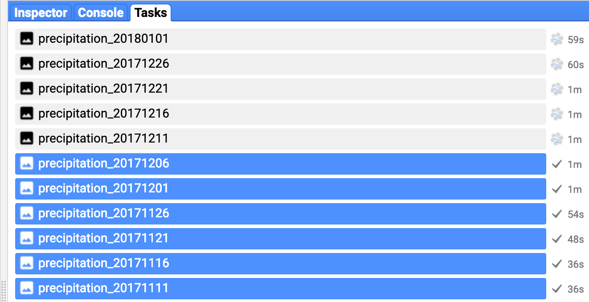

## geepy
   
Geepy is built up on Google Earth Engine's python api with a goal in mind of 
simplifying the process to access imagery for a particular area of our interest. 
The tool allows users to leverage ESRI's shapefile to crop and interact with a product.

Geepy also lets users download certain products for a time-series analysis by cropping 
and extracting image collections by the temporal resolution (e.g, 16-day, pentad, 1-day...) 
of the product. Hence, data for each temporal span will be exported as an individual geoTIFF file.
     
 ##### Installation

from github:

    git clone https://github.com/adbeda/geepy
    cd geepy
    pip install e .

##### Usage

Example: Get CHIRPS (rainfall) data for our study area `sample.shp`.

```python
import geepy
        
task = geepy.get_chirps("UCSB-CHG/CHIRPS/PENTAD", 
                        "../data/sample.shp", 
                        "2017-11-01", "2018-01-05", 
                         export=False)
```
     
The above script returns an image collection for the time period specified and if we want to, for instance, 
count the number of images/bands it contains, we can do:
 
```python
num_bands = len(task.getInfo()['features'])
print(num_bands)
```
output:

    >>> 13
   
   Alternatively, we can download the product by saving the bands individually.
   This can be done with the `export=True` option and starting the downloading task. 
   
```python
task = geepy.get_chirps("UCSB-CHG/CHIRPS/PENTAD", 
                           "../data/sample.shp", 
                           "2017-11-01", "2018-01-05", 
                           export=True)

task.start()
```

If job is successfully submitted, the task    will show up
on the GEE's web-based IDE under the tab 'Task Manager'.

   
   
    
 ##### From Terminal
 
  Geepy can be accessed from terminal as well. Currently, 5 commands are supported 
  and more will be to be added to support a wide variety of products. 
  
  
       
       Usage: geepy [OPTIONS] COMMAND1 [ARGS]... [COMMAND2 [ARGS]...]...
    
            Access Google Earth Engine Products by Area of Interest
    
    Options:
      --help  Show this message and exit.
    
    Commands:
      check-features     check shapefile readiness for processing
      check-metadata     check an image product's meta data
      download-chirps    download chrips imagery by area of interest
      download-modis     download modis products in area of interest
      download-sentinel  download sentinel imagery by area of interest
 
  To replicate the above example, we can request batch download on terminal with:
  
    geepy download-chirps'UCSB-CHG/CHIRPS/PENTAD' 'data/sample.shp' '2017-11-01' '2018-01-05'
    
  output on console: 
  
        submitted precipitation_20171101 for downloading
        submitted precipitation_20171106 for downloading
        submitted precipitation_20171111 for downloading...
        
  
  